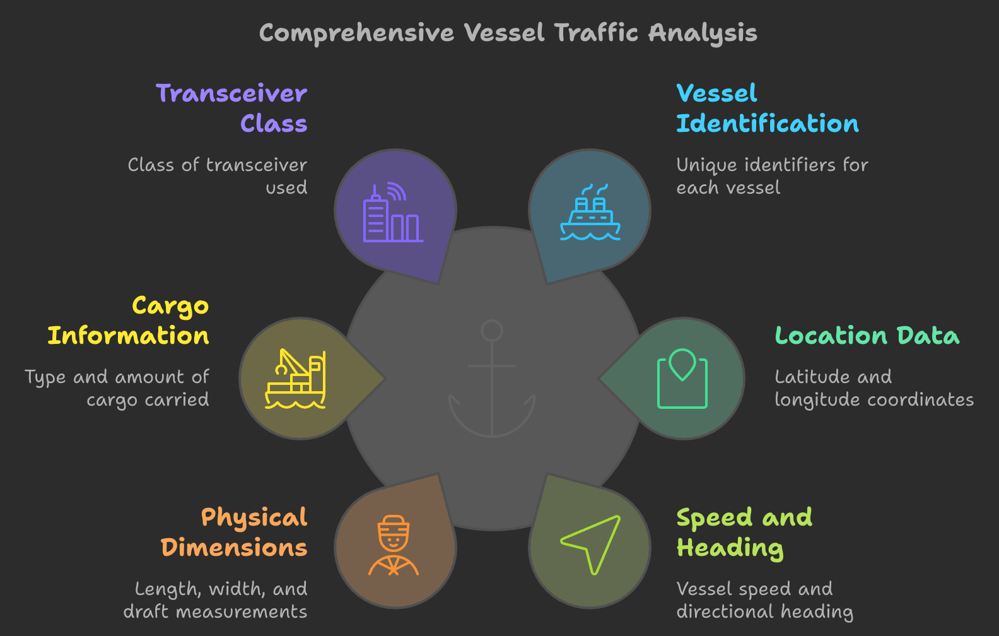

# JHipster AIS Kafka Application

The application's purpose is to import data files from the Marine Cadastre website, specifically those related to vessel traffic, and send them to a local Kafka server. The repository includes the source code, documentation, and instructions for setting up and running the application. The documentation highlights the use of a hexagonal architecture, the various package types within the application, and the importance of unit testing with assertions. It also provides details on the Apache Kafka technology used for data streaming.

# Example 

|MMSI     |BaseDateTime       |LAT     |LON       |SOG |COG  |Heading|VesselName        |IMO       |CallSign|VesselType|Status|Length|Width|Draft|Cargo|TransceiverClass|
|---------|-------------------|--------|----------|----|-----|-------|------------------|----------|--------|----------|------|------|-----|-----|-----|----------------|
|368926035|2023-01-01T00:00:05|38.65165|90.17964  |0.1 |360.0|511.0  |KIMMSWICK         |          |AENA    |33        |15    |      |     |     |33   |A               |
|367647050|2023-01-01T00:00:04|30.16506|-90.99936 |6.3 |161.4|511.0  |USS CAIRO         |          |WDH7325 |31        |0     |20    |     |     |31   |A               |
|352001704|2023-01-01T00:00:04|28.91963|-94.37033 |14.7|97.5 |97.0   |ENEOS EXPLORER    |IMO9935492|3E2723  |80        |0     |230   |36   |11.7 |80   |A               |
|367104060|2023-01-01T00:00:00|34.33537|-119.56046|14.8|202.9|511.0  |ALAN T            |IMO8982577|WDC9571 |60        |15    |28    |7    |     |0    |A               |
|367099730|2023-01-01T00:00:02|26.53889|-97.40485 |0.0 |360.0|511.0  |JESSIE M          |          |WDJ2892 |52        |0     |0     |0    |0.0  |52   |A               |
|367579120|2023-01-01T00:00:03|29.32348|-94.78112 |0.0 |248.5|511.0  |TERRY FONTENOT    |          |WDG8590 |31        |0     |16    |7    |     |52   |A               |
|367015890|2023-01-01T00:00:09|39.85300|-75.24165 |0.0 |360.0|511.0  |DOROTHY J         |          |WDC3893 |31        |0     |19    |7    |     |31   |A               |
|366995260|2023-01-01T00:00:01|30.47154|-91.19402 |0.6 |166.3|183.0  |CAPT JAMES HOOVER |          |WDC2583 |31        |0     |16    |6    |     |52   |A               |
|538008717|2023-01-01T00:00:01|23.64963|-83.18562 |5.7 |269.0|274.0  |VELOS FORTUNA     |IMO9347310|V7A2686 |89        |0     |182   |32   |7.5  |89   |A               |
|368261060|2023-01-01T00:00:06|30.51808|-91.22525 |9.8 |246.6|246.0  |AMERICAN SYMPHONY |          |        |60        |0     |100   |18   |0.0  |60   |A               |


 

## Prerequisites

### Java

You need to have Java 21:

- [JDK 21](https://openjdk.java.net/projects/jdk/21/)

### Node.js and NPM

Before you can build this project, you must install and configure the following dependencies on your machine:

[Node.js](https://nodejs.org/): We use Node to run a development web server and build the project.
Depending on your system, you can install Node either from source or as a pre-packaged bundle.

After installing Node, you should be able to run the following command to install development tools.
You will only need to run this command when dependencies change in [package.json](package.json).

```
npm install
```

## Local environment


<!-- jhipster-needle-localEnvironment -->

## Start up

```bash
./mvnw 
```

```bash
docker compose -f src/main/docker/kafka.yml up -d
```


<!-- jhipster-needle-startupCommand -->

## Documentation

- [Hexagonal architecture](documentation/hexagonal-architecture.md)
- [Package types](documentation/package-types.md)
- [Assertions](documentation/assertions.md)
- [Apache Kafka](documentation/apache-kafka.md)

<!-- jhipster-needle-documentation -->
